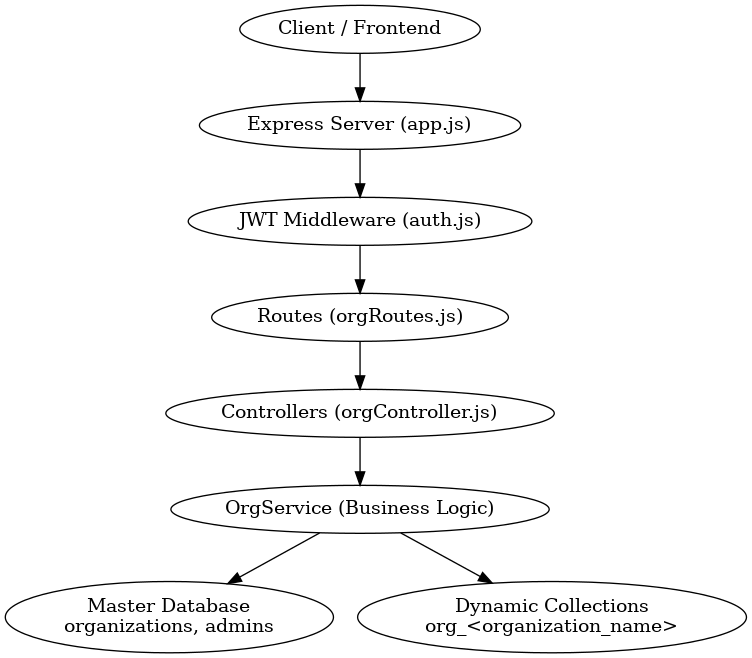

🚀 Organization Management Service (Node.js)

A multi-tenant backend service built with Node.js, Express, and MongoDB for managing organizations and admin authentication.

## 📊 Architecture Diagram

📌 Overview

This backend implements a multi-tenant architecture, where each organization receives its own dedicated MongoDB collection:

org_<organization_name>

A central Master Database stores:

Organization metadata

Admin user credentials (hashed)

Collection references

✔ Features Implemented

Create Organization

Get Organization

Update Organization (rename + data migration)

Delete Organization

Admin Login (JWT)

Password Hashing (bcrypt)

Dynamic per-tenant MongoDB collections

📁 Project Structure
.
├── controllers/
│   └── orgController.js
├── services/
│   └── orgService.js
├── routes/
│   └── orgRoutes.js
├── middleware/
├── examples/
├── auth.js
├── db.js
├── app.js
├── server.js
├── package.json
├── Dockerfile
└── README.md

✔ Modular, Class-Based Architecture

Controllers → Handle request/response

Service Layer (OrgService) → All business logic

db.js → Master DB + dynamic collection creation/migration

auth.js → JWT generation + bcrypt hashing

⚙️ Tech Stack

Node.js + Express

MongoDB (Native driver)

bcrypt (secure password hashing)

jsonwebtoken (JWT authentication)

dotenv for environment variables

▶️ How to Run the Application
1. Install dependencies
npm install

2. Create a .env file
MONGO_URI=mongodb://localhost:27017
MASTER_DB=master_db
JWT_SECRET=your_strong_secret_here
PORT=8000

3. Start the server
npm run dev

4. Test the API

Open in browser/Postman:

👉 http://localhost:8000

🧪 API Endpoints
1️⃣ Create Organization

POST /org/create

Creates:

Organization metadata

Admin user

Dynamic collection org_<name>

2️⃣ Get Organization

GET /org/get

Fetch organization metadata from Master DB.

3️⃣ Update Organization (Rename Tenant)

PUT /org/update

Performs:

Validate new name

Create new dynamic collection

Migrate old data → new collection

Delete previous collection

4️⃣ Delete Organization

DELETE /org/delete

Requires JWT token.

Deletes:

Organization metadata

Associated admin

Dynamic tenant collection

5️⃣ Admin Login

POST /admin/login

Returns:

admin_id

org_id

JWT token

🧩 High-Level Architecture (Explanation)

Client → Express → Routes → Controller → Service → MongoDB

All org operations flow through the service layer

Master DB stores metadata

Dynamic collections store organization-specific data

JWT middleware validates admin on protected routes

🏗 Design Choices
1. Multi-Tenant via Dynamic Collections

Each tenant gets an isolated Mongo collection:

org_acme
org_google
org_tesla

✔ Strong isolation
✔ Simple to query
✔ Easy scaling horizontally

2. Service Layer Architecture

Your OrgService handles:

Organization lifecycle

Dynamic collection creation

Copying/migrating collections

Deletion & cleanup

Controllers stay thin and clean.

3. Native MongoDB Driver

Chosen for:

Full low-level control

Easy dynamic collection creation

Fast performance

4. JWT Authentication

JWT contains:

admin_id

org_id

Stateless and scalable.

⚖️ Trade-Offs
Design	Pros	Cons
Collection-per-tenant	Great isolation	Too many collections for huge number of orgs
Native driver	Full control	More boilerplate than Mongoose
JWT	Stateless, fast	Hard to revoke tokens
Node.js	Lightweight, simple	Single-threaded
🔐 Security Notes

All passwords hashed using bcrypt

JWT secret must be strong

No plain-text credentials

Add input validation (Joi/Zod) for production

Consider rate limiting and HTTPS in deployment
